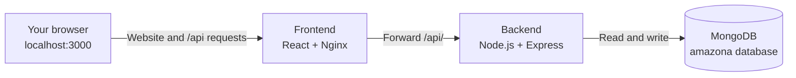
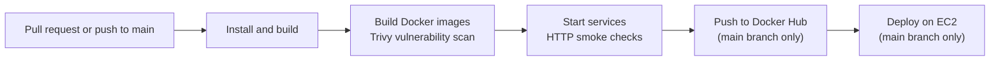

<div align="center">

# Amazona

### A full-stack online shop, from product browsing to order management

Explore a React storefront backed by a Node.js API and MongoDB. Run the complete application locally with one Docker Compose command, or use the included GitHub Actions workflow to build, scan, publish, and deploy it.


</div>

---

## Contents

- [See the shop](#see-the-shop)
- [What you can do](#what-you-can-do)
- [How it fits together](#how-it-fits-together)
- [Start locally with Docker](#start-locally-with-docker-recommended)
- [Try the admin features](#try-the-admin-features)
- [Run in development mode](#run-in-development-mode-without-docker)
- [CI/CD and deployment](#cicd-and-deployment)
- [Configuration and security](#configuration-and-security)
- [Troubleshooting](#troubleshooting)
- [Project layout](#project-layout)
- [Technology overview](#technology-overview)

## See the shop

The product photos below are included with the project. Start the app using the instructions below to browse the complete storefront.

<div align="center">
  
  
  
</div>

## What you can do

### As a shopper

- Browse the product catalog and view product details.
- Search, sort, and filter products.
- Add products to a shopping cart.
- Register, sign in, and manage a profile.
- Enter shipping details, place orders, and view order history.
- Rate and review products.

### As an administrator

- Manage the product catalog.
- Review and manage customer orders.
- Add the included sample product catalog from the product-management screen.

> **Note:** The sample catalog action replaces the existing product catalog. Use it only when that is what you intend.

## How it fits together

The storefront, API, and database run as separate services. In the packaged storefront, Nginx serves the React app and forwards `/api/` requests to the backend.



| Service | What it does | Local address |
| --- | --- | --- |
| Frontend | Displays the store and forwards API calls | [http://localhost:3000](http://localhost:3000) |
| Backend | Provides product, account, and order API routes | [http://localhost:5000](http://localhost:5000) |
| MongoDB | Stores products, users, and orders | `localhost:27017` |

## Start locally with Docker (recommended)

Docker Compose starts the website, API, and database together. You do **not** need to install Node.js or MongoDB separately for this option.

### 1. Install Docker

Install and start [Docker Desktop](https://www.docker.com/products/docker-desktop/) on Windows or macOS. On Linux, install Docker Engine and the Docker Compose plugin. Check that Docker is running before continuing.

### 2. Get the project

If you have Git installed, clone the repository you want to run:

```sh
git clone <repository-url>
cd <repository-folder>
```

Or download and extract the project files, then open a terminal in the folder containing `docker-compose.yml`.

### 3. Build and start the app

```sh
docker compose up --build
```

The first run may take a few minutes while Docker downloads base images and builds the application. Keep this terminal open while the services run. When startup completes, visit:

- **Storefront:** [http://localhost:3000](http://localhost:3000)
- **Product API:** [http://localhost:5000/api/products](http://localhost:5000/api/products)

The product API returns JSON. It is a convenient way to check that the backend is responding.

### 4. Stop the app

Press **Ctrl+C** in the terminal running Compose. If you started it in the background with `-d`, stop it from the project folder with:

```sh
docker compose down
```

Stopping the services does not delete the database. MongoDB stores its data in the `mongodb_data` Docker volume, which is reused the next time the app starts.

### Helpful Compose commands

Run each command from the project folder:

| Command | What it does |
| --- | --- |
| `docker compose up --build` | Build images if needed and run services in the foreground |
| `docker compose up --build -d` | Build and run services in the background |
| `docker compose ps` | Show service status |
| `docker compose logs -f` | Follow logs from all services |
| `docker compose logs -f backend` | Follow backend logs |
| `docker compose down` | Stop and remove the containers and network, keeping database data |

## Try the admin features

The project includes a demo administrator account for local evaluation:

1. Start the application with Docker Compose.
2. Open [http://localhost:5000/api/users/createadmin](http://localhost:5000/api/users/createadmin) once to create the demo account.
3. Go to [http://localhost:3000/signin](http://localhost:3000/signin) and sign in:

   | Field | Demo value |
   | --- | --- |
   | Email | `admin@example.com` |
   | Password | `1234` |

4. Open the product or order management pages to explore the admin features.
5. To add sample products, use the sample-catalog action on the product-management screen.

> **Important:** These demo credentials and the account-creation route are public defaults in the source code. This is for local demonstration only. Do not expose them on an internet-accessible installation.

## Run in development mode (without Docker)

Use this option if you want to work on the frontend or backend source directly. You need **Node.js 20 or newer**, **npm 10 or newer**, and a MongoDB server running on your computer.

### Start MongoDB and the backend

Make sure your local MongoDB service is running, then, from the project root:

```sh
npm install
npm start
```

The backend uses `mongodb://localhost/amazona` by default and listens on port `5000`.

### Start the frontend

Open a second terminal in the project root and run:

```sh
cd frontend
npm install
npm start
```

When prompted, open [http://localhost:3000](http://localhost:3000). The frontend development server forwards API requests to the backend at `http://127.0.0.1:5000`.

### Local configuration

The backend reads these environment variables:

| Variable | Default | Purpose |
| --- | --- | --- |
| `PORT` | `5000` | Port used by the backend |
| `MONGODB_URL` | `mongodb://localhost/amazona` | MongoDB connection address |
| `JWT_SECRET` | `somethingsecret` | Secret used to sign authentication tokens |
| `PAYPAL_CLIENT_ID` | `sb` | PayPal client ID returned by the API |
| `AWS_REGION` | `us-east-1` | AWS region for S3 image uploads |
| `accessKeyId` | `accessKeyId` | AWS access key ID for S3 image uploads |
| `secretAccessKey` | `secretAccessKey` | AWS secret access key for S3 image uploads |

To override a value in a local terminal, set it before starting the backend. For example, in PowerShell:

```powershell
$env:MONGODB_URL = "mongodb://localhost:27017/amazona"
$env:JWT_SECRET = "replace-this-with-a-private-random-value"
npm start
```

For Docker, set application configuration in the backend service environment in `docker-compose.yml`. Never commit real passwords, private keys, or cloud credentials to the repository.

## CI/CD and deployment

The workflow at `.github/workflows/ci.yml` runs on pull requests targeting `main` and pushes to `main`.



### Pull request checks

For a pull request to `main`, GitHub Actions:

1. Installs backend and frontend dependencies.
2. Builds the React frontend and both Docker images.
3. Scans the backend and frontend images with Trivy. The workflow fails for reported **HIGH** or **CRITICAL** vulnerabilities that have a fix available.
4. Starts the services and checks that the website and product API respond.
5. Stops the test containers.

These are build, image-scan, and HTTP smoke checks; the workflow does not currently run a separate application unit-test suite.

### Publish and deploy on `main`

After the checks pass on a push to `main`, the workflow publishes `latest` and commit-specific Docker images to Docker Hub, then deploys the `latest` images to an EC2 server using `docker-compose.prod.yml`.

To enable publishing and deployment, add the following under **GitHub repository → Settings → Secrets and variables → Actions → New repository secret**:

| Secret name | Value |
| --- | --- |
| `DOCKERHUB_USERNAME` | Docker Hub account username |
| `DOCKERHUB_TOKEN` | Docker Hub access token with permission to push images |
| `SERVER_HOST` | Public IP address or DNS name of the EC2 server |
| `SERVER_USER` | SSH username on the EC2 server |
| `SERVER_SSH_KEY` | Private SSH key used by GitHub Actions to connect |

The EC2 server needs Docker and the Docker Compose plugin installed. The SSH user must be able to run Docker commands. The workflow copies the production Compose file and deploys under `~/amazona`.

The production Compose file expects the workflow to have pulled and tagged the published images locally as `amazona-frontend:latest` and `amazona-backend:latest`. For a manual deployment, first pull the images from your Docker Hub account and tag them with those local names, then run:

```sh
docker compose -f docker-compose.prod.yml up -d
```

## Configuration and security

- The local Compose setup uses MongoDB 7 and persists data in the `mongodb_data` volume.
- The local setup publishes ports `3000`, `5000`, and `27017` on the host for convenience. Do not expose the database port publicly.
- The backend has development defaults for the JWT secret and PayPal client ID. Replace demo values before any public deployment.
- Configure real PayPal or AWS S3 credentials only if you intend to use those integrations. Pass credentials using a secure environment or secret-management system.
- The demo administrator account and its creation endpoint are not suitable for production use.
- The included deployment workflow transfers and starts containers on EC2; HTTPS, DNS, firewall hardening, and production-grade database configuration must be set up separately.

## Troubleshooting

### The website does not open

- Confirm Docker Desktop or Docker Engine is running.
- Check whether the containers are up with `docker compose ps`.
- Review startup output with `docker compose logs -f`.
- Make sure ports `3000` and `5000` are not already in use by another application.

### The API does not return products

- Check backend logs with `docker compose logs -f backend`.
- Confirm MongoDB is running with `docker compose ps`.
- Check that the backend uses the Compose service address `mongodb://mongodb:27017/amazona`. From inside a container, `localhost` means that same container, not the MongoDB service.

### I changed files but the website still looks the same

If you are using Docker, rebuild the images and recreate the services:

```sh
docker compose up --build
```

### I want a fresh local database

> **Warning:** The following removes all data in the local Compose database.

```sh
docker compose down --volumes
docker compose up --build
```

Only use `--volumes` when you are certain you no longer need the saved database data.

## Project layout

```text
.
├── .github/workflows/ci.yml   # CI checks, image publishing, and EC2 deployment
├── backend/                   # Express API, routes, models, and Dockerfile
├── frontend/                  # React app, static assets, Nginx config, and Dockerfile
├── docker-compose.yml         # Local services (builds images from source)
├── docker-compose.prod.yml    # Production services (uses prebuilt images)
└── README.md                  # Project documentation
```

## Technology overview

| Area | Tools |
| --- | --- |
| Storefront | React, Redux, React Router |
| API | Node.js, Express |
| Database | MongoDB, Mongoose |
| Web serving and proxy | Nginx |
| Containers | Docker, Docker Compose |
| Automation | GitHub Actions |
| Image vulnerability scanning | Trivy |
| Deployment target | AWS EC2 |
